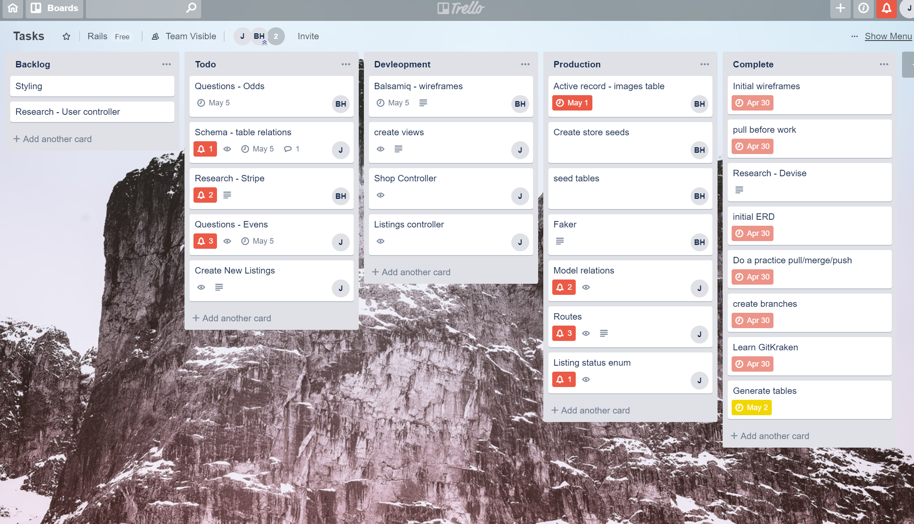
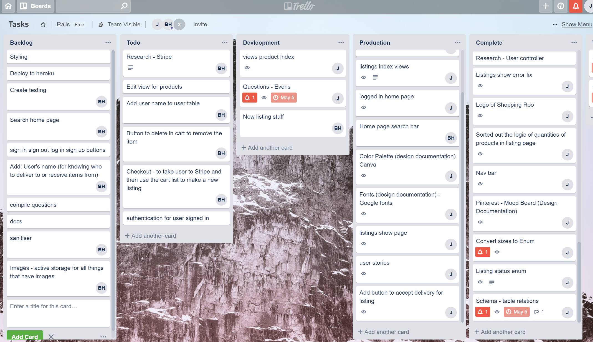
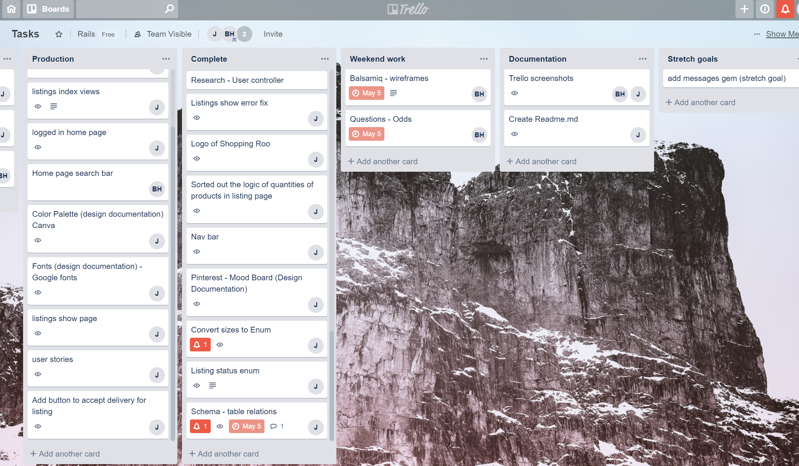

# README for Shopperoo App

## [ Project - Github Repo](https://github.com/josephine-c/Rails_Assessment)
## [Published App - Heroku](https://blooming-lowlands-28068.herokuapp.com/)

### **Description** 
The Shopperoo app resolves the problem of shopping for items which users are usually inaccessible to for reasons such as inconvenient store hours (same as user’s work hours) or an absent online store/website (i.e. small business boutique stores). Shopperoo will allow any user to purchase items and any user to be able to forfill the order (i.e. task of buying listed items and delivering them to the purchaser)

### **Features**:
* **Authorization**
    - Sign up
    - Log-in
* **Navigation**
    - Links
    - Buttons
    - Nav bar
* **Shops**
    - Browse shops
    - Browse items/products associated with shops
* **Shopping lists**
    - Create Lists/jobs
    - View open shoppings lists(Yet to be accpeted)
    - Accept Lists/jobs
    - Mark job status as delivered
* **Cart**
    - Add items to cart
    - Remove items from cart
    - Checkout
* **Payment**
    - Stripe redirection
    - Third party payment handling.

### **Shopperoo App Screenshots**

[INSERT images of finished App]

## **Tech-stack**
* Ruby on Rails
* Puma
* HTML/CSS
* Slack
* Goggle Docs
* GitHub
* GitKraken
* Trello
* Heroku
* DBeaver
* Cypress
* Ultrahook
* Stripe

* **Gems**:
    - Devise 
    - Cypress
    - Byebug
    - Bootstrap
    - Stripe

### **Ruby version**:  
* ruby 2.6.0p0

### **System dependencies**: 
* devise
* aws-sdk-s3 ~> 1.36
* faker ~> 1.9
* stripe ~> 4.16
* ultrahook ~> 0.1.5

* *For other dependencies please check the gemfile* 

### **Deployment instructions**

    $ gem install bundler
    $ bundle install

### **Database creation and initialization**

    $ heroku run bundle install
    $ heroku run rails db:create
    $ heroku run rails db:migrate
    $ heroku run rails db:seed

### **User Instructions for Shopperoo App**
* [Open site](https://blooming-lowlands-28068.herokuapp.com/)
* From the landing page navigate to join or login links

#### 1. Home
* 
* from any page click the 'home' link in the nav bar.

#### 2. Sign up 
* 
* This will take you back to the landing page.

#### 3. Log in
* 
* This will take you back to the landing page.

#### 4. Purchasing items (As a Purchaser) - Spending Money
* From the 'home' page
* Click on 'shops' button in nav bar
* Find your desired shop within the shops page.
* Click on the 'show products' button or the 'shop name' link
* Add desired products to cart.
* When finished selecting items click on 'cart' link.
* If User is happy with selections 
* Click 'checkout' button
* Proceed with stripe checkout.
* After payment the user will be redirected to the payment success page.
* Log out when you have finished using the App

#### 5. Completing an ordering job (As a Courier) - Earning Money
* From the 'home' page
* Click on 'Jobs Available' in the nav bar
* Click on the Listing Number or 'Show' button to see details of the listing
* Once happy to take the listing job - click into the listing and click on the 'Accept Job' button at the top of the page
* This will then redirect you to your homepage and the listing will display under your 'Jobs' list
* Once a job has been completed click on the 'delivered' button to confirm your job has been completed for your job payment to be processed
* This job will be removed from your homepage and you are set to chose your next job listing.
* Log out when you have finished using the App

## **Design Documentation**
### **1. Design Process** 
**i. Mood board** (developed using Pintrest) 

Ideally the shops in Shopperoo would give an online prescence to small boutique buisnesses which may not have an online store/wesbite. Images from various store catorgies range from bookstores, stationary, art/craft supplies stores, baby shops, women/mens's clothing and jewellry stores, bicycle shops, hiking/sporting goods stores, shoe stores and other cute and quaint shops. There is an industrial, handmade, minimalistic feel to the mood/vibe of the mood board.

**ii. Color Scheme** (sourced using Canva)

 From the mood board one of the happy pictures from a bicycle shop was used to develop a color palette/scheme (see image below) for the Shopperoo App.

**iii. Typography/Font Design** 

Using Google Fonts, two fonts were selected to be used in the Shopperoo App, to maintain the 'industrial/minimalistic feel' branding and maintain consistency throughout the App. These are Stardos Stencil and Poiret One (see examples below).

**iv. Logo Design**

Having a fun play of words as the name of the App (i.e. Shopperoo = Shopping + Kanga"Roo"), we designed a logo of a kangaroo carrying a pink parcel. Pink was chosen as a happy joyful color, expressing 'happiness' to the users recieving their package.

### **2. User stories**:
* As **Josephine**, I want to be able to get outfit accessories from a cute boutique shop on the other side of town (while I’m busy at work) delivered to me so that I can look my best when delivering my work presentation.
* As **Bryce**, I want to make money in my spare time performing quick shopping trips, so that I have extra money to spend on the weekend. 
* As **MonsterThreads**, I want to become more accessible to customers so I can generate more revenue.

### **3. A workflow diagram of the user journey/s**

Inital User journey/s

[MAKE & INSERT IMAGE]

### **4. Wireframes**
Inital low-fid Wireframes 1

Inital low-fid Wireframes 2

#

### **5. Database Entity Relationship Diagrams (ERD)**

## **Details of planning process** 
### **Project plan & timeline (A & B)**

### **A. Project plan:**

**Meetings:** Meetings were conducted twice a day to decide on sprints each day, deciding if we achieved our goals and if further work is required.

**Start date** of project: 29.04.2019

**Sprint 1 (29.4.2019):** Establishing minimum viable product (MVP), inital wireframes and ERD.

**Sprint 2 (30.4.2019 - 2.5.2019):** Scaffold the Rails application, with PostgreSQL database - work on customising, routes, controllers, models and views

**Sprint 3 (3.5.2019 - 7.5.2019):** Work on features: User authorisation (using Devise gem), Cash payment (using Stripe gem), active storage of images (using AWS S3)

**Sprint 4 (8.5.2019):** Work on Design aspects of the web App, installing Bootstrap gem

**Sprint 5 (9.5.2019 - 12.5.2019):** Automated testing/Debugging and Deployment on Heroku, and Documentation and Presentation compilation 

**End date** of project: 12.05.2019

### **B. Timeline** (See above for greater detail on the different tasks within the sprints)

**1. DESIGN** (29.4.2019) - Initial wireframes and ERD and on 8.5.2019 on more high fidelity aesthetics for web app

**2. DEVELOPMENT** (30.4.2019 - 9.5.2019) - Creating the app on Ruby on Rails, installing all the gems and creating all the features, such as creating active storage on Amazon S3 and creating a Stripe account to use on the App.

**3. DEPLOYMENT** (9.5.2019 - 12.5.2019) - Using Heroku to deploy the web App.

**3. TESTING** (9.5.2019 - 12.5.2019) - Using byebug (gem) is used throughout the development of the app, however the automated testing Cypress (gem) to test the different user inputs for the web app, is done during 9.5.2019 to 12.5.2019.

**5. DOCUMENTATION** (29.4.2019 - 12.5.2019) - Collecting trello screenshots and working on different aspects of the documentation happens throughout the entire duration of the project, however finalising and compiling will mainly be covered in the last project sprint (Sprint 5 - 9.5.2019 to 12.5.2019)

### **Screenshots of Trello boards during timeline**
**Initial App ideas Trello Board:**

**Agile Project Managment Trello Board from 29.04.2019 to 11.05.2019**

29.04.2019

30.04.2019

01.05.2019

02.05.2019 am

02.05.2019 pm

03.05.2019 pm

08.05.2019

08.05.2019 continued

10.05.2019

## **Short Answer questions (Section 2.2):**

**1. What is the need (i.e. challenge) that you will be addressing in your project?**

We are addressing the need of a two-way digital market place (i.e. Web application). Designing a two-sided market place will allow users to connect with each other to either buy or sell goods or services. It is important to address this need of having a two-sided market place to allow globalisation/accessibility of goods and/or services to people who truly need them. In today's society when people are too busy or live/travel remotely, convenience is often found by online shopping (i.e. accessing the interet through a phone or laptop). Therefore it is important to know how to develop and build products such as a Ruby on Rails two-way market place web App!

**2. Identify the problem you’re trying to solve by building this particular marketplace App? Why is it a problem that needs solving?**

The problem we are trying to solve by building a Ruby on Rails two-sided market place is the problem of inaccessibility of products to people who need them. 

**Case-study 1:** The working professional (i.e. working 9am to 5pm) vs. small/regular shops which buisness hours are between 10am to 6pm. Solving the issue of people unable to access shops which are only open during times while they are at work during the weekday, is important as it will allow these busy professionals more of a lunch break than an "errand-run" break, which may lead to better workforce preformance and happier individuals. This problem is quite a big one in Australia, as the majority of our shops typically only operate one hour more than the normal 9-5 job business hours, so there is a very short window for busy corporate people/workers to fit in shopping for items during the weekday.

**Case-study 2:** Online delivery vs. quick courier delivery by everyday people. This app would also resolve the issue of waiting for long periods to recieve products after purchasing them from online stores that rely on Australia/International Post (e.g. waiting periods of 5-30 days to your home address, and if you're at work, trying to organize when you can pick up the item from the post office if they leave a collecting card). Our App will allow everyday people to complete the shopping orders and deliver them to your preferred address. This means that your items can be delivered as fast as within the next few hours or within the next few days, depending on when you placed your order and how fast a user has accepted the job. This is a problem that needs solving as there are busy people who do not have personal assistants to help them with same day delivery on purchases and lives would be greatly enriched by faster, customizable deliveries (e.g. Have a wedding on the weekend and need pair of formal heels quick).

**Case-study 3:** Helping visibility of fantastic boutique shops and small-buisnesses that do not have an online presence, to better connect with new and existing customers. Often people do not have time to shop at boutique and small stores as their business hours will clash with a busy work schedule. By linking these people with willing couriers to do the shopping for small fee both parties can enjoy the benefits of the app.

**3. Describe the project you will be conducting and how your App will address the needs.**

The web App we are designing and developing is called Shopperoo. This is a two-sided marketplace, built using Ruby on Rails with PostgreSQL database and deployed on Heroku. Shopperoo is designed to list the products of small boutique stores, allowing Shopperoo users to purchase their desired items from those listed on the App. Users are able to both make purchases (i.e. listings) and work as a shopper/courier (i.e. buy's items from the stores and delivers them to the purchaser) for a fee. The Shopperoo App features cart, checkout..

Describe the project The actual features in the app – cart and check out )(what the project is about, how you fix the issue) will you be conducting and how. your App will address the needs. More detail about q1 - 

**4. Describe the network infrastructure the App may be based on.**

How people are connecting to it – heorku – internet – https -over the internet and web server that’s running. Connecting to db and how it does it
We want to build an app similar in application to UberEats where there is a selection of an item and a delivery time if within the store hours.
Thus the network infrastructure the App may be based on would be a website app that is built using Ruby on Rails and deployed on Heroku. Stretch goals would implement Geoloction APIs (for store locations and tracking deliveries).

**5. Identify and describe the software to be used in your App.**

Rails: Development framework, used to scaffold and provide inbuilt functionality.
Faker: Provide test data to allow for seeding of database.
Devise: Used for authentication and verification of users on creation, editing and application access.
Stripe: Used to handle transactions and avoid storring sensative data.
Ultrahook: Allows for testing of webhooks send by stripe forwarding any information to localhost.
cypress: Automatic testing to ensure the application is working correctly.

#### Ruby-On-Rails
* Rails is a model–view–controller (MVC) framework, providing default structures for a database, a web service, and web pages.

#### Faker - GEM
* [Faker - github link.](https://github.com/stympy/faker)
* [Owner - github link.](https://github.com/stympy)
* A library for generating fake data such as names, addresses, and phone numbers.
* Used to populate database for testing.

#### Devise - GEM
* [Devise - github link.](https://github.com/plataformatec/devise)
* [Owner - github link.](https://github.com/plataformatec)
* Devise is a flexible authentication solution for Rails based on Warden. It:
* Is Rack based;
* Is a complete MVC solution based on Rails engines;
* Allows you to have multiple models signed in at the same time;
* Is based on a modularity concept: use only what you really need.

**6. Identify the database to be used in your App and provide a justification for your choice.**

PostgreSQL database will be used in our App as it is an open-source relational database management system emphasizing extensibility and standards compliance. It can handle workloads ranging from single-machine applications to Web services or data warehousing with many concurrent users. PostgreSQL is ACID-compliant and transactional. It offers support for RDBMS features such as updatable and materialized views, triggers, foreign keys; functions and stored procedures. [ref.wiki]

**7. Identify and describe the production database setup (i.e. postgres instance).**

PostgreSQL is a powerful, open source object-relational database system that uses and extends the SQL language combined with many features that safely store and scale the most complicated data workloads.

Postgres is a client/server application, allowing us to create, access and destroy databases.

Running postgres - how you setup the database - onto heroko and seed into db

At its base level a postgresql database is made up of tables, With each table being made up of rows and columns. Each row has the same sets of columns and each column is a specific type. Each row is identified by a unique identification. This identification is used to reference all columns and the data held within them.

**8. Describe the architecture of your App.**

Users can be both a purchaser and/or a courier/deliverer, tables are made for the orders/listings which are linked to the shops and transactions are made through a 3rd party Web app Stripe. 
MVC architecture – Ruby on rails – using postgresql – building blocks of the app - heroku

**9. Explain the different high-level components (abstractions) in your App.**

Our application follows an MVC structure and breaking tasks up into views, models and controllers.
The application is taking advantage of Faker and Devise Gems to add extra features(making payments and user verification).
For styling we're using bootstrap.

**10. Detail any third party services that your App will use.**
Stripe - Its software allows individuals and businesses to make and receive payments over the Internet. Stripe provides the technical, fraud prevention, and banking infrastructure required to operate online payment systems. Wikipedia

Heroku - Heroku is a cloud platform that lets companies build, deliver, monitor and scale apps. We're using this service to deploy our application.

AWS - We are using this service to store any files and pictures that are required to be saved.

Git Hub and Git kraken - We used these services for version control.

**11. Describe (in general terms) the data structure of marketplace apps that are similar to your own (e.g. eBay, Airbnb).**

Airtasker - Similar posting for jobs and accpeting of jobs structure.

Uber, menulog, deliveroo - The app requires a user to deliver items other users.

**12. Discuss the database relations to be implemented.**

#
USER: HAS ONE:
•	Cart
•	Contact {Polymorphic}
•	Accepts nested attributes
#
HAS MANY:
•	Listings
•	Deliveries
•	Pictures {attached}
Being a user is a requirement for most features within the app. And thus has many connections and associations. This ID is way to link those associations.

SHOP: HAS ONE:
•	Contact {Polymorphic}
#
HAS MANY:
•	Listings 
•	Products 
•	Pictures {attached}
#
PRODUCTS: BELONGS TO:
•	shop
#

HAS MANY:
•	Listings product {join table}
•	Listings through listings product
•	Cart product {join table}
•	Carts through cart product
•	Pictures {attached}
#

ORDER: BELONGS TO: 
•	Listing
#

LISTINGS_PRODUCT: BELONGS TO:
•	Listings
•	Products
#

LISTING: BELONGS TO:
•	User
•	Shop
•	Oder
•	Delivery
	HAS MANY:
•	Listings product {join table}
•	Products through listings product
#

DELIVERY: BELONGS TO:
•	User
•	Lisiting 
#

CART: HAS ONE:
•	Shop
•	User {Polymorphic}
#

HAS MANY:
•	Cart product {join table}
•	Products
#

**13. Describe your project’s models in terms of the relationships (active record associations) they have with each other.**

User contains an email and password
- We wanted to keep this as revelent to a user account and exdend an extra information into the contact table.

Contact is for shops and users.
- Right now each row holds an address and a phone number for users and shops. 

Cart/cart_products hold the users desired items.
- This is a list of products related to the user. 

listings/listings_products is a copy of cart
- Only for listings that have gone past the stripe checkout process successfully.

Deliveries is a way to make users able to do both deliveries and create listings.
- By having this makes a listing able to access two users, the courier and the one that created the list.

Transactions holds stripe verification.
- This will allow refunds and cancelling orders for users in future.

Shops
- holds a description for the shop

Products
- Associated with a shop
- These are the stock and contents of a shop.

**14. Provide your database schema design.**

**15. Provide User stories for your App.**

**User stories**:
* As **Josephine**, I want to be able to get outfit accessories from a cute boutique shop on the other side of town (while I’m busy at work) delivered to me so that I can look my best when delivering my work presentation.
* As **Bryce**, I want to make money in my spare time performing quick shopping trips, so that I have extra money to spend on the weekend. 
* As **MonsterThreads**, I want to become more accessible to customers so I can generate more revenue.

**16. Provide Wireframes for your App.**

wireframehomeloggedin.png)

**17. Describe the way tasks are allocated and tracked in your project.**

Tasks are identified by breaking problems down as a team and posting each individual part on the backlog of the team trello board. As team members complete work and move the associated cards from the to-do list, they move more work to from the backlog  onto to-do and assign it to themselves. 

**18. Discuss how Agile methodology is being implemented in your project.**

Every day we do a sprint
Trello board has been set up with Backlog/to do, Development, Production, Complete. Agile methodology is being implemented in the project by finishing tasks and then making new tasks as required for the next sprints. 

**19. Provide an overview and description of your Source control process.**

During the development process each task was worked and tested on a dedicated branch. Once the feature that was being developed on a branch satisfied tests and was free of errors, remote master was then merged into the local working branch and a merge request could be generated back into remote master. This allows for conflict free coding, separation of tasks and the ability to deal with merge conflicts before touching the master.

To facilitate this process we used github and git kraken.

**20. Provide an overview and description of your Testing process.**

Using byebug, and edge cases to test the App currently
If there are bugs put into trello
Automated testing Cypress
- Testing for all nav bar features.
    - log in
    - log out
    - home
    - cart
    - jobs
    - Shops
- Testing for create listing.
- Testing for create new user.
- testing for add to cart.

**21. Discuss and analyse requirements related to information system security.**

Brute force attacks 

User account hijacking

SQL injection attacks - These can be dangerous as this can be used to steal sensitive information like credit card, password, etc. To lower the risks for an attack, we have used to devise to gather and store sensative data and Stripe to handle any payments.

Session storage - For this application we have avoided using session to store sensative data, as it is not secure enough for security requirements.

Rails has security features that within the framework to prevent SQL injections. In modern rails versions, cookies are now encrypted and provide an extra layer of protection.

Passwords are encrypted and saved to the datebase.

**22. Discuss methods you will use to protect information and data.**

- stripe to protect payment and to avoid handling any financial information.
- Images storred in amazon
- devise 
- in future encrypt phone numbers

**23. Research what your legal obligations are in relation to handling user data.**

The Privacy Act 1988 defines what personal information.This Act has 13 Australian Privacy Principles (APPs).

We need to follow these principles.

“The NDB scheme requires entities to notify affected individuals and the Australian Information Commissioner, in the event of an ‘eligible data breach’.”
This applies to all entities that hold personal information. This action is required for any breach that could cause serious harm to any individual who the information is applicable to.
